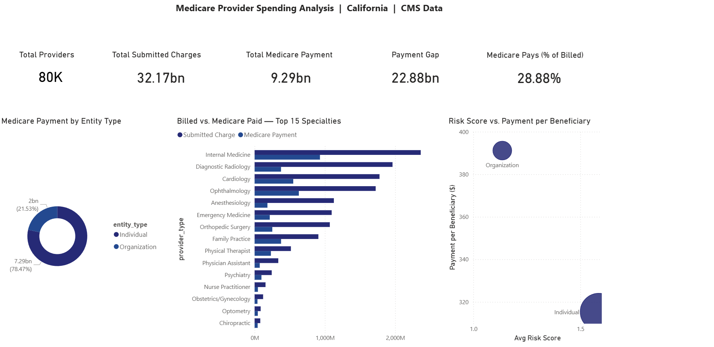
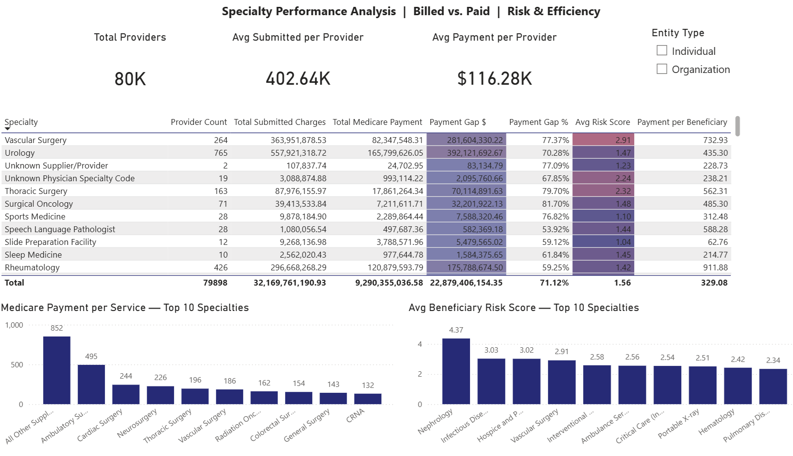
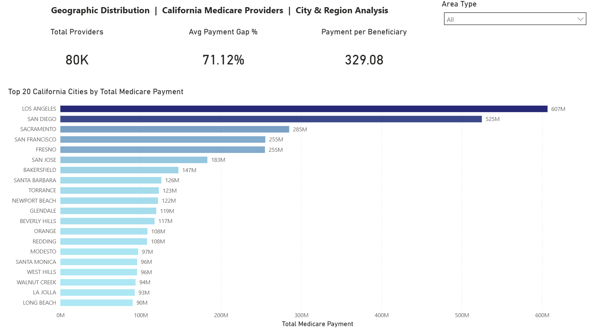

# Medicare Provider Spending Pipeline

An end-to-end data pipeline that extracts, cleans, and models real CMS Medicare provider financial data, revealing the gap between what providers bill and what Medicare actually pays.

## Overview

This pipeline ingests real, publicly available CMS data on ~80,000 California-based Medicare providers, validates and transforms it in Python, loads it into a PostgreSQL star schema, and produces analytics-ready tables for SQL and Power BI analysis.

## Business Problem

Healthcare providers submit charges to Medicare, but Medicare pays a standardized, often much lower amount. Understanding this "billed vs. paid" gap and how it varies by specialty, geography, and provider type — is core to healthcare finance and value-based care analysis, directly relevant to Medicare cost containment and provider network design.

## Dashboard Preview

### Financial Overview

### Specialty Analysis

### Geographic Analysis

## Power BI File

The full interactive dashboard file is available here: [`powerbi/medicare_spending_dashboard.pbix`](powerbi/medicare_spending_dashboard.pbix)

**Note:** Requires Power BI Desktop (free) to open. GitHub cannot render `.pbix` files directly — see the screenshots above for a static preview, or download the file to explore interactively.

## Architecture

CMS source data (CSV)
|
Extract (Python) — stream + filter to California
|
Raw layer (data/raw/)
|
Transform + validate (Python) — clean, split into fact/dim
|
PostgreSQL — star schema (local)
|
Analytics — SQL queries + Power BI dashboard

## Technology Stack

- **Python** (pandas, requests, SQLAlchemy) — extraction, transformation, loading
- **PostgreSQL** — relational data warehouse, local instance
- **SQL** — analytical queries (joins, aggregations, window functions, CASE)
- **Power BI** — dashboard visualization
- **Git/GitHub** — version control

## Data Source

CMS "Medicare Physician & Other Practitioners – by Provider" dataset (data.cms.gov), filtered to California during extraction. Real, publicly available, provider-level aggregated data — no individual patient records involved.

## Pipeline

1. **Extract** (`src/extract.py`) — streams the national CSV in chunks, filters to California, saves to `data/raw/`
2. **Transform** (`src/transform.py`) — cleans nulls/duplicates, renames columns, splits into fact/dimension tables, validates alignment
3. **Load** (`src/load.py`) — applies the SQL schema, loads both tables into PostgreSQL, verifies row counts
4. **Orchestration** (`src/pipeline.py`) — runs all three steps as one command

## Data Model

**`dim_provider`** — descriptive attributes (name, specialty, location)
**`fact_provider_spending`** — financial and utilization measures (submitted charges, Medicare payment, services, derived markdown %)

Linked on `npi` (National Provider Identifier), enforced via foreign key.

## Data Quality

- Primary key (`npi`) validated as unique and non-null
- Core financial columns required non-null for inclusion
- Rows with missing name/PK dropped (4 rows, 0.01% of data) — documented in transform logs
- Heavy missingness in demographic breakdown columns reflects CMS's own privacy-suppression rules for small patient counts, not a data quality defect

## Analytics

See `sql/analytics_queries.sql` for: top providers by payment gap, average markdown % by specialty, provider ranking via window functions, risk-tier bucketing, rural vs. urban comparison.

## How to Run

1. Clone this repo
2. Create a virtual environment and install dependencies: `pip install -r requirements.txt`
3. Create `.env` with your local PostgreSQL credentials (see `.env` structure in repo docs)
4. Ensure PostgreSQL is running locally
5. Run the full pipeline: `python src/pipeline.py`
6. Run tests: `pytest -v`

## Project Structure

medicare-de-pipeline/
├── data/
│ ├── raw/ (gitignored — regenerate via extract.py)
│ └── processed/ (gitignored — regenerate via transform.py)
├── notebooks/
│ └── 01_eda.ipynb
├── src/
│ ├── extract.py
│ ├── transform.py
│ ├── load.py
│ └── pipeline.py
├── sql/
│ ├── schema.sql
│ └── analytics_queries.sql
├── tests/
│ └── test_pipeline.py
├── requirements.txt
├── .gitignore
└── README.md

## Key Learnings

Built a full ETL pipeline from a real government data source; learned data modeling (star schema), reproducible extraction over manual downloads, data quality validation with documented decisions, and connecting a local database to BI tooling.

## Future Improvements

- Orchestration via Airflow (scheduled, retryable runs)
- Containerization via Docker (portable environment)
- Cloud deployment (GCP Cloud SQL / BigQuery)
- dbt for transformation testing and lineage
- Incremental loading instead of full refresh
- Automated CI testing on every commit
